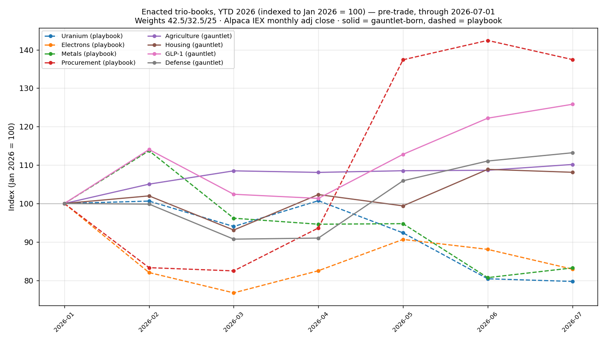
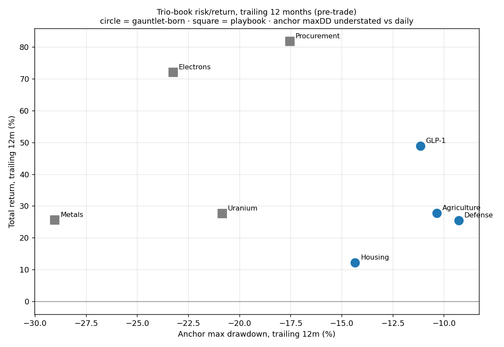

# The Thales Project — Interim Review

**2026-07-05 · paper trading only · a calibration ledger, not financial advice**

*Written the weekend before the first fills. Every order is still `accepted`, not filled —
the market opens Monday 2026-07-06. This is therefore a review of a method and a book at
the moment of truth, before the market has said anything back.*

---

## 1. Executive summary

In two sessions we went from a set of API keys to a live paper-trading operation: a
public GitHub repository, two custom tools, **eight three-legged positions** worth
~$40,200 of a $100,000 paper account, a written hypothesis for each, an event-based exit
doctrine, a daily monitoring loop, and an audited skill that turns a raw hypothesis into
a tradable structure.

The trading model is **not a close copy of any single named strategy**. Its fingerprint
is a deliberate splice: the *structure* of regime-balanced investing[^1], the *discipline*
of scientific pre-registration[^2], and the *objective* of a forecasting tournament[^3] —
where the goal is calibration[^4], not profit. Where it most resembles a known financial
strategy, the resemblance is partial and is stated as such in §4.

The report also does something the method demands of itself: it audits its own
**integrity**. Our core loop is *hypothesis → test the market → take a viable position*.
We drifted from it in two ways — one useful, one dangerous — and §6 names both without
flinching, because a calibration ledger that flatters itself is worthless.

---

## 2. How we got here

The path was incremental, and each step was a reaction to the last.

1. **Connection and a single share.** We stored the Alpaca[^5] paper credentials, tested
   the connection, and bought one share of Apple — a plumbing test, never a thesis. It
   still sits in the ledger labelled "excluded from grading," which is itself a small act
   of the discipline to come: even the throwaway trade is logged honestly.

2. **A ledger and a home.** We built a repository around the Thales Playbook — the user's
   pre-existing method — and published it. The method was not invented here; it arrived
   in two PDFs. Our job was to *operationalise* it.

3. **The playbook trios.** Four trios came with the playbook already specified — Uranium,
   Electrons, Metals, Procurement. We enacted them at $5,000 each. Note the ordering, it
   matters later: **the positions came first; we wrote their hypotheses down afterward.**

4. **The scout and the gauntlet.** We scanned the tradable universe for new sectors, then
   ran six of them through the "gauntlet" — a pre-registered test that tries to *kill*
   each candidate before it can join the book. Four sectors yielded a surviving trio
   (Agriculture, Housing, GLP-1, Defense); two yielded *findings* — honest "no valid
   trio" verdicts (Space, AI-datacenter power). Crucially, here the ordering flipped:
   **the hypothesis and kill-criteria were written before the data was pulled.** This is
   the core model working as designed.

5. **Exit doctrine and monitoring.** We wrote event-based stop-losses (§ the exit-trigger
   report), had a second model[^6] attack the alert rules for reliability, and set a
   daily loop to watch for the triggering events.

6. **Tooling.** Two skills now encode the method: one executes paper trades; one turns a
   hypothesis into a gauntlet-ready trio, with proxy fallbacks when a seat can't be
   filled directly. The second was tested and audited (11/11 vs 5/11 for a no-skill
   baseline) before this report.

The through-line: **start from a falsifiable idea, structure it, and let pre-declared
criteria decide.** The moments we're proudest of and the moments we're wariest of both
come from how faithfully we held that line.

---

## 3. What the model actually is

Every position is a **trio** — three assets filling three distinct *seats*:

- **Engine** — the asset that *is* the thesis. If the idea is right, this revenue line
  shows it.
- **Tollbooth** — collects regardless of which competitor wins (a fee, rent, royalty, or
  regulated return). Presses, not pickaxes[^7].
- **Regime-inverse** — *feeds* when the thesis fails (not merely survives). This is the
  internal hedge: the leg designed to bleed in the base case and pay off in the bad one.

Weights are fixed at entry (42.5% / 32.5% / 25%), held for twelve months, no rebalancing.
Before entry, each candidate must survive **five kill criteria**[^8] — viability,
authenticity, survival, self-funding, non-redundancy — and every kill must name the
criterion that fired. Alongside the trios sits a small, hard-capped "cicada" sleeve[^9]
for rare dated-event bets; it is currently empty.

The stated product is **not returns**. It is calibration: a growing record of written
predictions, pre-declared kill-lines, and honestly graded outcomes. "Green P&L on a dead
mechanism is a rejection that got lucky" is the house motto, and it is the tell that this
is a forecasting discipline wearing a portfolio's clothes.

---

## 4. Which financial strategy is this most like?

**Short answer: no single one — similarity is moderate at best, and the closest analogs
are conceptual rather than mechanical.** The table rates the resemblance honestly.

| Known strategy | What it shares | Where it differs | Similarity |
|---|---|---|---|
| **All-Weather / risk parity**[^1] | The regime-inverse leg — holding assets that win in *different* macro regimes so the book isn't a single bet | Thales balances regimes *within one theme per trio*, not across the whole portfolio; uses **no leverage** and no volatility-weighting, which are the defining machinery of risk parity | **Moderate (concept only)** |
| **Thematic / sector basket** | Each trio is a concentrated bet on one sector's mechanism | A plain thematic basket has no internal hedge and no falsification test; Thales bolts both on | **Moderate** |
| **Long/short equity** | The `short(N)` proxy rung, and the "inverse" language | Thales is overwhelmingly **long**; shorts appear only as a last-resort synthetic seat, never a paired book; there is no market-neutral target | **Low** |
| **Barbell / tail-hedging**[^10] | The core-plus-cicada shape: a stable core plus tiny asymmetric bets | Thales's core is itself risk-bearing equity, not the "safe" end of a true barbell | **Low–moderate** |
| **Event-driven / catalyst investing** | Kill-lines and checkpoints are dated to real catalysts (earnings, legislation) | Event-driven funds trade the event; Thales uses events as *falsification dates*, not as the trade | **Low–moderate** |
| **Superforecasting / forecasting tournaments**[^3] | The actual objective — calibration, pre-registration, honest grading, "grade the mechanism not the luck" | This is an *epistemology*, not a financial strategy; it says nothing about position construction | **High (on objective), N/A (on mechanics)** |
| **Systematic/discretionary macro "thesis + stop"** | Enter on a thesis, exit on a pre-defined invalidation | Macro desks size by conviction and trade continuously; Thales fixes weights and holds | **Moderate** |

**The honest synthesis.** If forced to name it in one line: *a long-biased thematic
equity book with an internal regime hedge, constructed and exited under
science-style pre-registration, run to maximise forecasting calibration rather than
return.* The three ingredients each exist in the wild; the **combination**, and
especially the calibration objective, is what makes off-the-shelf labels fit poorly.
Anyone who tells you this is "just risk parity" or "just thematic investing" is matching
on one feature and ignoring the other two.

---

## 5. The book at the moment of truth (pre-trade charts)

These are built the same way as the gauntlet analyses — Alpaca monthly closes[^11],
dividend-adjusted, each trio treated as a fixed-weight book indexed to a starting value.
They show the eight enacted trios **as of Friday's close, before Monday's fills**.

### Chart 1 — Year-to-date, indexed to January 2026

### Chart 2 — Trailing-12-month return vs. maximum drawdown

### The numbers behind the charts

| Trio | Origin | YTD 2026 | Trailing-12m return | Max drawdown[^12] |
|---|---|---:|---:|---:|
| Uranium | playbook | −20.3% | +27.7% | −20.8% |
| Electrons | playbook | −17.1% | +72.0% | −23.2% |
| Metals | playbook | −16.8% | +25.5% | −29.0% |
| Procurement | playbook | +37.4% | +81.8% | −17.5% |
| Agriculture | gauntlet | +10.2% | +27.7% | −10.3% |
| Housing | gauntlet | +8.1% | +12.2% | −14.3% |
| GLP-1 | gauntlet | +25.8% | +48.9% | −11.2% |
| Defense | gauntlet | +13.2% | +25.4% | −9.3% |

**Read this table with suspicion, not satisfaction.** The gauntlet-born trios (bottom
four) look tidier — every one positive YTD, drawdowns clustered around −10%, while three
of the four playbook trios are *negative* YTD with deeper drawdowns. It is tempting to
conclude the gauntlet builds better trios. **That conclusion is largely circular, and
§6 explains why.** These charts are the pre-trade baseline against which the *forward*
record — the only record that counts — will be graded from Monday onward.

---

## 6. Integrity: the drift we watched for, and the drift that happened

Our core model is a straight line: **hypothesis → test the market → take a viable
position.** Idea first; structure second; commitment last. We consciously tried not to
drift from it. We drifted anyway, in two directions — and telling them apart is the whole
point of this section.

### 6.1 The useful drift (upside): the gauntlet mass-produces trios

The gauntlet machinery let us take *six* sectors from raw idea to graded verdict in a
single session, reusing one analysis engine, one data pipeline, one output shape. That is
leverage of the good kind: more falsifiable structures per unit of effort, and — because
two of the six honestly returned "no valid trio" — a method that produces **findings**,
not just positions. Breadth like this is how a calibration ledger earns statistical
power: ten dated predictions teach more than two. This drift we keep.

### 6.2 The dangerous drift (downside): reverse-engineering the hypothesis

Here is the uncomfortable part, stated plainly.

**(a) We wrote some hypotheses *after* taking the positions.** The four playbook trios
were enacted first; their hypotheses (H1–H4 in the hypothesis register) were written
down afterward, reverse-engineered from positions that already existed. In forecasting,
this has a name — **HARKing**[^13], Hypothesising After the Results are Known — and it is
corrosive precisely *because it feels like insight*. A hypothesis fitted to a position
you already hold can be phrased so it cannot fail; and a prediction that cannot fail
produces **fake calibration**. You end up grading a forecast you never actually made in
advance. For a project whose entire product is calibration, that is not a small blemish —
it is the failure mode that voids the warranty.

**(b) The charts in §5 select on the same window they're measured on.** The gauntlet's
survival test (K3) *kills* any candidate with a negative trailing-12-month return. So of
course the gauntlet-born trios show positive trailing returns and shallow drawdowns —
**they were chosen for exactly that.** Comparing them to the playbook trios, which were
*not* filtered on Alpaca trailing data, and concluding the gauntlet is "better," is
comparing a hand-picked sample to an unfiltered one on the very metric used to pick it.
This is selection bias wearing the costume of a result. The tidy bottom four of the
table are an artifact of the selection rule, not yet evidence of skill.

### 6.3 Why this matters, and what protects us

Neither drift is fatal *if it is labelled*, and both are:

- The reverse-engineered hypotheses are **explicitly marked** as reverse-engineered in
  the register; they are not passed off as forward predictions.
- The gauntlet pre-registration files are committed to version control **before** the
  data is pulled — a timestamped, tamper-evident record that the forward hypotheses
  really were forward. Git is doing the work a lab notebook does in science.
- The one honest verdict on §5's charts is written into §5 itself: *read with suspicion.*

And the real protection arrives Monday. Every position's grade date is **2026-08-15 and
beyond** — genuinely out-of-sample, after fills, on data that did not exist when the
hypotheses were written. **The forward record cannot be reverse-engineered.** That is the
only evidence that will count, and it is the reason the distinction in this section is
worth being this strict about: the backward-looking story is contaminated by
construction; the forward-looking one is clean by construction. We grade on the latter.

**The standing rule going forward, to keep the useful drift and kill the dangerous one:**
no position enters the book without a pre-registered, committed hypothesis *first* — the
`hypothesis-to-trio` skill exists to enforce exactly that ordering. Playbook trios H1–H4
will be graded with an explicit discount for their post-hoc origin. Integrity here is not
politeness; it is the difference between measuring our judgement and flattering it.

---

## 7. Current book and open threads

- **Deployed:** ~$40,200 of $100,000 (~40%), no leverage. Eight trios + one plumbing
  share, all `accepted`, filling at Monday's open.
- **All first checkpoints:** 2026-08-15. Nearest early trigger: Fastenal's mid-July
  monthly sales print.
- **Findings on the shelf:** Space and AI-datacenter power (no valid trio; conditions to
  reopen each are logged).
- **Open threads:** (1) the daily monitoring loop currently lives in a session-scoped
  scheduler that expires in ~7 days — it needs promotion to a persistent routine; (2)
  Monday's fills must be written into the ledger with real entry prices to arm the price
  backstops; (3) the cicada sleeve is empty and awaits a qualifying dated event.

---

## 8. Limitations

Backtests and the §5 charts rest on **monthly** closes from a **single, thinner data
feed**[^11], across **one regime of history** — a benign-to-strong year for most of these
sectors. Drawdowns computed from monthly points are **understated** versus daily reality.
Dividend-adjusted series flatter the raw-price experience of the yield-heavy names. None
of the eight positions has filled yet, so there is **zero realised performance** to
report — by design, this is a pre-trade document. And the whole enterprise is **paper**:
no capital is at risk, which removes the single most important source of behavioural error
in real trading, and that absence should temper any confidence drawn from what follows.

*Reviewers are invited to attack §6 hardest of all — that is where the method lives or
dies.*

---

## Footnotes

[^1]: **All-Weather / risk parity** — an approach (associated with Bridgewater's
All-Weather fund) that holds assets balanced to perform across different economic
"regimes" (growth/inflation up or down), typically using leverage to equalise each
asset's risk contribution. Thales borrows the *regime-balancing idea* but not the
leverage or the risk-equalising math.

[^2]: **Pre-registration** — the scientific practice of publicly recording a hypothesis
and analysis plan *before* collecting data, so results can't be retrofitted to a story.
Borrowed here via committing kill-criteria to git before pulling prices.

[^3]: **Forecasting tournament / superforecasting** — structured prediction contests
(Philip Tetlock's research) where success is measured by *calibration and accuracy of
stated probabilities*, not profit. Thales's objective function is this, not a fund's.

[^4]: **Calibration** — the degree to which stated confidence matches reality: if you say
70% and you're right 70% of the time, you're well-calibrated. The project's actual
deliverable.

[^5]: **Alpaca** — a brokerage with an API for automated trading; its *paper* environment
simulates fills with fake money against real market data.

[^6]: **A second model** — the alert rules were independently inspected by a different
Claude model (Fable) to reduce single-author blind spots.

[^7]: **"Presses, not pickaxes"** — the Thales metaphor: in a gold rush, sell the tools
(or here, own the toll) rather than dig. Thales of Miletus cornered the olive *presses*.

[^8]: **Five kill criteria (K1–K5)** — viability (real size, not a bankruptcy candidate),
authenticity (the asset genuinely *is* the thesis seat), survival (positive trailing year,
drawdown better than ~−60%), self-funding (no forced dilutive capital raise), and
non-redundancy (not too correlated with another seat). See the glossary for each.

[^9]: **Cicada sleeve** — a small (<5% of book), hard-capped allocation to rare events
whose date is fixed in advance (like a periodical cicada emergence), which the market has
forgotten to price. Currently empty.

[^10]: **Barbell / tail-hedging** — an allocation (associated with Nassim Taleb) that
combines very safe assets with a few high-payoff, low-cost bets, avoiding the "medium
risk" middle.

[^11]: **Data feed (IEX vs SIP)** — Alpaca's free tier serves prices from the IEX
exchange only (thinner volume) rather than the consolidated SIP tape (all exchanges), so
monthly closes can differ marginally from the "official" consolidated close.

[^12]: **Maximum drawdown** — the largest peak-to-trough drop over the window, expressed
as a percentage. Here computed from monthly points, so it *understates* the intra-month
lows a daily series would show.

[^13]: **HARKing** — "Hypothesising After the Results are Known." Presenting a hypothesis
invented to fit already-seen data as if it had been predicted in advance. A recognised
research-integrity failure; the central risk §6 guards against.

---

## Glossary

- **Anchor** — a verified, dated price point used to reconstruct a return series when a
  full data feed isn't available.
- **Authenticity (K2)** — a kill criterion: the asset must genuinely embody its seat, not
  merely be adjacent (e.g. a conglomerate that happens to touch the theme fails).
- **Backtest** — simulating how a fixed set of positions would have performed over past
  data. Evidence, never proof; Thales treats a winning backtest as killable.
- **Book** — the whole portfolio, or a single trio treated as a mini-portfolio with fixed
  weights.
- **Calibration** — see footnote 4. The project's true objective.
- **Cicada sleeve** — see footnote 9.
- **Drawdown** — a fall from a prior peak; "max drawdown" is the worst such fall in a
  window.
- **Engine** — the trio seat that *is* the thesis; carries the most weight (42.5%).
- **Gauntlet** — the pre-registered process of trying to kill each candidate before it
  can join the book; survivors become positions, and a sector that fills no valid trio
  becomes a logged *finding*.
- **HARKing** — see footnote 13. The integrity failure of writing hypotheses after seeing
  results.
- **Kill criteria (K1–K5)** — see footnote 8. The five pre-declared tests every candidate
  must survive.
- **Kill-line** — a pre-declared, specific event that, if observed, closes a position;
  the exit-doctrine equivalent of a stop-loss, but triggered by *evidence*, not price.
- **Notional** — the dollar size of a position (here, e.g., $2,125 for an engine leg),
  independent of share count.
- **Paper trading** — simulated trading with fake money against real prices; no capital
  at risk.
- **Playbook trio** — one of the four trios inherited pre-specified from the Thales
  Playbook PDFs (Uranium, Electrons, Metals, Procurement), enacted before their
  hypotheses were formalised.
- **Pre-registration** — see footnote 2.
- **Proxy ladder** — the fallback sequence when a seat can't be filled directly: a listed
  proxy (e.g. an ETF), then a synthetic short (`short(N)`), then declaring the seat
  unfillable.
- **Regime** — a broad macro-economic state (e.g. high inflation, or an industrial
  recovery). The regime-inverse seat is defined by *which* regime helps it.
- **Regime-inverse** — the trio seat that *feeds* when the thesis fails; the internal
  hedge. Must feed, not merely dodge.
- **`short(N)`** — notation for a synthetic seat built by short-selling asset N (profiting
  if N falls); used only as a last-resort proxy, with its costs (it hedges rather than
  feeds; carries borrow cost) logged.
- **Tollbooth** — the trio seat that collects regardless of which competitor wins; prefers
  a toll on the installed *stock* over a toll on transaction *flow*.
- **Trio** — the three-seat unit (engine + tollbooth + regime-inverse) that is the
  project's atomic position.
- **Uninsured quadrant** — the one scenario that hurts all three seats of a trio at once;
  named in advance for every position so the blind spot is known, not discovered.
